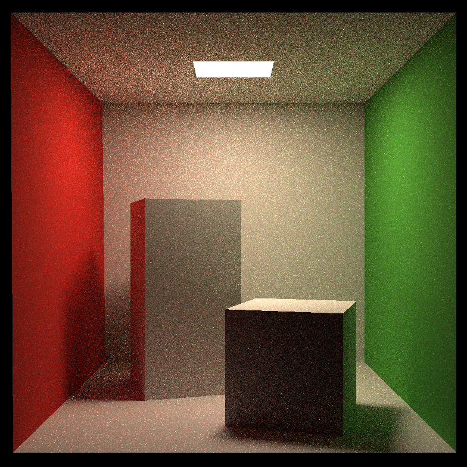

# GAMES 101

My implmentation for [GAMES 101 Introduction to Computer Graphics](https://sites.cs.ucsb.edu/~lingqi/teaching/games101.html).

## Rendering Results

- Raterization

  

- Whitten-style Ray Tracing

 

- Path Tracing

